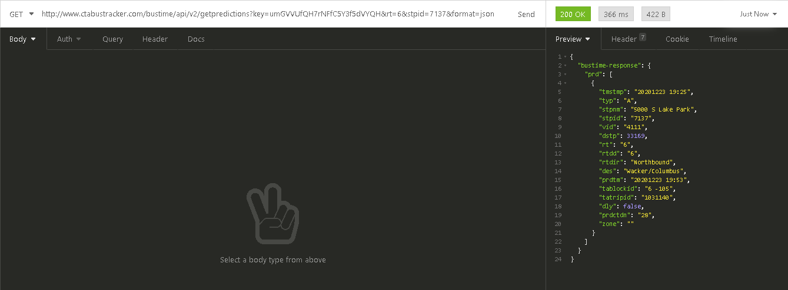
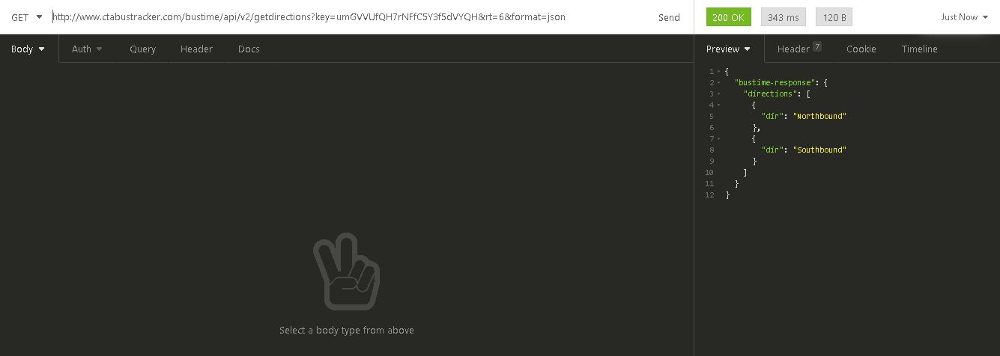
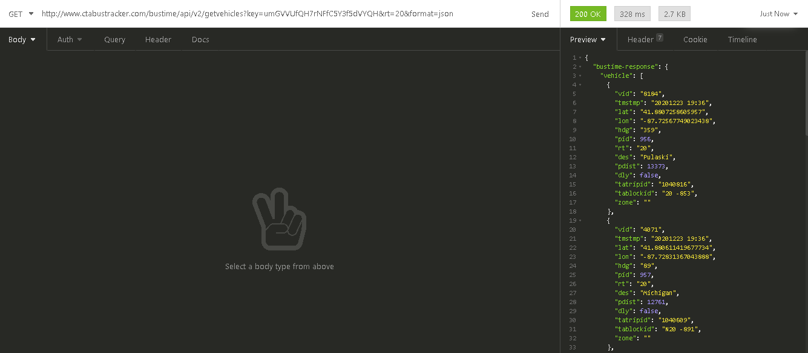

# Geolocation

## Sobre a API

Esta API provê informações sobre o serviço de ônibus na cidade de chicago, contém vários tipos de informações como
coordenadas geográficas dos ônibus, horários, paradas, rotas etc. Mais detalhes nos itens abaixos.
## Documentação da API 

Para que seja possível fazer as consultas nesta api, deve-se executar os seguintes passos:
    1.1 É necessário que você (desenvolvedor) vá até o site da ctabustracker
    1.2 Crie sua conta
    1.3 No topo da página deve ser possível ver um link que fala sobre API, clique nele!
    1.4 preencha as informações e no e-mail receberá a chave de autenticação. 

#### Página de login

#### Documento PDF

1. Quais  tipos de dados podem ser obtidos dessa fonte em específico? Verifique a documentação da API e os termos de serviço e mostre alguns exemplos.

#### Esta API provê informações como:
* Localização dos veículos
* Dados de rota (Lista de rotas, lista de paradas, etc.)
* Dados de predição Ex.(Quando chegará um próximo ônibus na parada com id = X)
* Serviço de boletins que são basicamente alertas.

## Exemplos
#### Capturando informações de predição de quando um próximo ônibus irá passar naquela parada

#### Capturando informações de quais direções o ônibus vai a partir de uma rota específica

#### Capturando informações de quais ônibus passam por uma rota específica

2. Explique o funcionamento da API escolhida e mostre o formato de retorno dos dados (XML? JSON? CSV?) - caso tenha mais de uma formato escolha um.

Bom, está api é bem completa no quesito informação, assumindo que esteja apto a ler em inglês. A API te informa de quais são os parâmetros da consulta, também descrevendo quais são obrigatórios e opcionais. A API Também te informa quais as informações ela irá mandar de resposta, caso a consulta seja bem sucedida. A resposta dos dados
são em formato XML e JSON, sendo o padrão XML e caso você queira em JSON, basta informar na URL (&format=JSON).

#### Exemplo de resposta em XML

